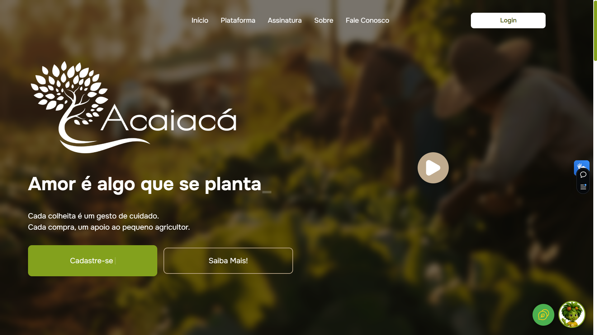

# 🌿 Acaiacá

A Acaiacá é uma plataforma que conecta pequenos agricultores diretamente aos consumidores, valorizando a produção local e promovendo relações mais humanas, justas e conscientes no acesso aos alimentos.

## 💻 Plataforma



A arquitetura da plataforma Acaiacá incorpora a inclusão como um requisito central desde sua fase de projeto. Recursos de acessibilidade, tais como navegação por voz, sistema de comandos otimizado e uma interface de usuário (UI) intuitiva e de fácil navegação, são implementados para assegurar a utilização universal. É tecnologia com propósito, feita para todos.

<ul>
  <li><a href="https://plataforma-acaiaca.vercel.app/" target="_blank">
    🌐 <strong>Plataforma Online</strong>
  </a></li>


<li>
  <a href="https://www.figma.com/design/UbY4ih0tBA93Zc3nckwc8Y/Acaiac%C3%A1-Design-Novo" target="_blank">
    🎨 <strong>Protótipo no Figma</strong>
  </a></li>


</ul>

## 🛠 Tecnologias Utilizadas

<ul>
  <li>
    
    <strong> HTML5</strong> – Utilizado para estruturar semanticamente a aplicação.
  </li>
  <li>
    
    <strong> Chakra UI</strong> – Biblioteca de componentes para estilização com foco em acessibilidade e produtividade.
  </li>
  <li>
    
    <strong> JavaScript</strong> – Responsável pela lógica e interatividade da aplicação.
  </li>
  <li>
    
    <strong> React</strong> – Framework para criação de interfaces modernas com componentes reutilizáveis.
  </li>
  <li>
    
    <strong> Axios</strong> – Biblioteca para requisições HTTP e consumo de APIs.
  </li>
  <li>
    
    <strong> Vite</strong> – Utilizado para build e desenvolvimento com carregamento ultrarrápido.
  </li>
</ul>

## 📦 Instalação e Uso

<p>
      Antes de começar, verifique se você atende aos seguintes requisitos:
   </p>

- Certifique-se que instalou a versão mais recente do Node.js.  [Baixe aqui](https://nodejs.org/en)
- Certifique-se de que instalou algum um editor de código em sua máquina. [Baixe aqui](https://code.visualstudio.com/)
<br/>

Siga os passos abaixo para executar o projeto localmente:

```bash
# 1. Clone o repositório
git clone https://github.com/Acaiaca-Agricultores/Front-end_ReactJS.git

# 2. Acesse a pasta do projeto
cd front-end/

# 3. Instale as dependências
npm install

# 4. Inicie o servidor de desenvolvimento
npm run dev

# plataforma-acaiaca-teste-dados-mockados
